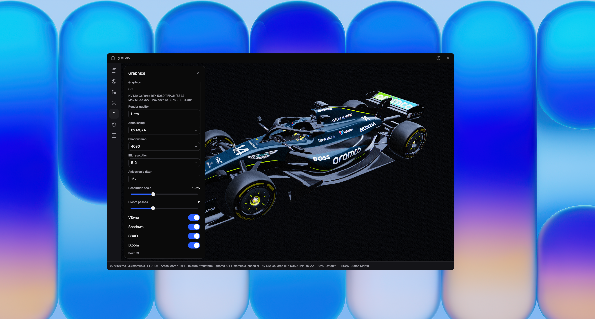

# GLStudio

[](https://isocpp.org/)
[](https://www.qt.io/)
[](https://www.khronos.org/opengl/)
[](https://cmake.org/)
[](https://www.khronos.org/gltf/)
[](#build)

Realtime native **glTF / GLB** look-development studio. Drop a model on the viewport, light it with HDRI and a three-point rig, inspect PBR channels, play animations, and export stills or turntables — without a browser, a DCC, or a cloud viewer.



---

## What it is

GLStudio is a desktop OpenGL application for previewing production glTF assets the way a lookdev or product-visualization artist would: physically based shading, image-based lighting, studio lights, post-processing, and debug buffers — all in a custom frameless Qt window.

It is **not** a modeling tool and **not** a web embed. It is a local, GPU-driven viewer that treats `.glb` / `.gltf` as the interchange format and OpenGL 3.3 Core as the runtime.

Typical use:

- Check how a glTF looks after export from Blender, Maya, or a baker.
- Compare material variants, morphs, and animation clips.
- Light a product shot with an HDRI plus key / fill / rim.
- Isolate a mesh, inspect albedo / roughness / metallic / IBL, then dump an 1080p–8K PNG or a turntable.

---

## What it solves

Web glTF viewers (three.js, Babylon.js, `<model-viewer>`, Sketchfab) are excellent for sharing. They are weaker as a **local lookdev bench**:

| Pain with browser viewers | How GLStudio addresses it |
| --- | --- |
| GPU, RAM, and texture size capped by the tab | Native OpenGL, MSAA up to 16×, shadow maps up to 8192, IBL up to 1024, resolution scale up to 300% |
| CORS, drag-and-drop of folders, and sidecar `.bin` / textures | Direct filesystem: drop `.glb` / `.gltf` / `.exr` / `.hdr`, or copy files into `models/` and `hdri/` next to the exe |
| EXR IBL is awkward or unsupported in the browser | TinyEXR + Radiance HDR → lat-long → cubemap, irradiance, prefiltered specular, BRDF LUT |
| Hard to match a studio lighting setup | Key / fill / rim with color, yaw, pitch, plus scene `KHR_lights_punctual` |
| Export is a screenshot of the canvas | Offline render to PNG (including transparent) and turntable (MP4 via ffmpeg, else PNG sequence) up to 7680×4320 |
| GC pauses, WebGL precision, and shader subset | C++ / GLSL 330 core, GPU skinning, GPU morph targets |
| Look settings vanish with the tab | Saved cameras and lookdev presets in `QSettings` |

It also avoids spinning up Blender or Unreal just to see whether an exported glTF still looks right.

---

## Desktop vs web viewers

GLStudio and a typical **web** glTF stack solve overlapping problems with different constraints.

```
  Asset (.glb / .gltf)
           │
     ┌─────┴──────┐
     │            │
 Native GLStudio   Browser viewer
 OpenGL 3.3        WebGL 2 / WebGPU
 Qt Widgets        three.js / Babylon / model-viewer
 Local files       URL / CDN / drag-drop (often GLB only)
 EXR IBL, 8K out   Shareable link, zero install
```

| | **GLStudio (this repo)** | **Web viewers** |
| --- | --- | --- |
| Runtime | Qt 6 + OpenGL 3.3 Core (`QOpenGLWidget`) | WebGL 2 or WebGPU inside the browser |
| Distribution | Local `glstudio.exe` | URL, npm package, iframe |
| Input | `.glb`, `.gltf` + sidecars, `.exr`, `.hdr` | Usually a single `.glb` (sidecars need a static server) |
| Lighting | HDRI IBL + three-point rig + punctual glTF lights | Mostly IBL; studio rigs are app-specific |
| Materials | Metallic-roughness PBR + clearcoat, transmission, volume, sheen, iridescence, unlit, variants | Depends on the engine; Khronos Sample Viewer is the reference |
| Compression | `EXT_meshopt_compression`, `KHR_mesh_quantization` | Often Draco **and** meshopt (GLStudio skips Draco primitives) |
| Animation | Clips, loop, scrub, morph weights, GPU skinning | Usually yes, with engine-specific limits |
| Lookdev | Debug buffers, clay mode, shadow catcher, DOF, ACES/Reinhard/Filmic | Rare outside specialized lookdev apps |
| Offline output | PNG / transparent PNG / turntable | Canvas capture, if any |
| Sharing | Send the exe + asset, or a screenshot | Send a link |

**When to use the desktop app:** local QC, lighting, high-resolution stills, EXR environments, inspecting extensions the status bar reports as used or ignored.

**When to use a web viewer:** embedding on a site, sending a client a URL, or CI that already runs headless Chromium. Good references: [Khronos glTF Sample Viewer](https://github.khronos.org/glTF-Sample-Viewer-Release/), [Google `<model-viewer>`](https://modelviewer.dev/), [three.js `GLTFLoader`](https://threejs.org/docs/#examples/en/loaders/GLTFLoader).

### glTF vs GLB

Both are glTF 2.0. The difference is packaging, not shading.

| | **`.gltf` (JSON)** | **`.glb` (binary)** |
| --- | --- | --- |
| Layout | JSON document + external `.bin` buffers and image URIs | One file: `glTF` magic, JSON chunk, BIN chunk ([spec](https://registry.khronos.org/glTF/specs/2.0/glTF-2.0.html#glb-file-format-specification)) |
| Editing | Easy to diff and patch | Opaque until unpacked |
| Web delivery | Needs all sidecars on the same origin | One request — preferred for the web |
| GLStudio | Imports JSON and copies sidecar URIs next to the file | Drop on the viewport or into `models/` |

---

## Features

**Scene**

- Load `.glb` / `.gltf` from the Model panel, the `models/` folder, or drag-and-drop.
- Scene outliner, isolate node, hide parts, click-to-select in the viewport.
- Animation clips, play / loop / scrub, morph target weights.
- `KHR_materials_variants` switching.
- Scene cameras from the file, plus saved orbit cameras.

**Look**

- HDRI from `.exr` / `.hdr` (drop or `hdri/` folder).
- Environment intensity and yaw; optional sky.
- Key / fill / rim lights with color and spherical direction.
- Optional `KHR_lights_punctual` from the asset.
- Looks: Showroom, Soft daylight, Overcast, Night, Clay studio.
- User lookdev presets (lighting, shading, post, GPU).
- Shadow catcher floor, grid, axes, clay mode.

**Shading and post**

- Metallic-roughness PBR with GGX, split-sum IBL, and a BRDF LUT.
- Clearcoat, transmission, volume / IOR, sheen (Charlie), iridescence, emissive strength, unlit.
- MSAA, cascaded-style PCF shadows, SSAO, bloom, vignette, DOF.
- ACES, Reinhard, Filmic, or linear tone mapping.
- Contrast, saturation, temperature, tint, sharpen, grain, chromatic aberration.
- Debug views: lit, albedo, world normal, roughness, metallic, occlusion, direct light, specular IBL, shadows, emissive.

**Export**

- Still PNG at 1080p, 1440p, 4K, or 8K.
- Transparent background.
- Turntable: MP4 if `ffmpeg` is on `PATH`, otherwise a PNG sequence.

---

## Architecture

```
main.cpp                 Qt app, OpenGL 3.3 Core format, Fusion style
window.cpp / .hpp        Frameless shell, rail, sheets (edgeqt)
viewport.cpp / .hpp      QOpenGLWidget: upload, IBL, shading, post, export
glb_loader.cpp / .hpp    glTF 2.0 parser (JSON + GLB), meshopt decode
hdri_loader.cpp / .hpp   EXR (TinyEXR) and Radiance HDR → cubemap
tinyexr_impl.cpp         TinyEXR implementation unit
ui/                      edgeqt widgets, theme, icons
third_party/tinyexr/     TinyEXR + miniz
```

CMake also FetchContents [meshoptimizer](https://github.com/zeux/meshoptimizer) `v0.22` for `EXT_meshopt_compression`.

### Render path

1. **Load (worker thread)** — parse glTF, decode meshopt views, expand accessors, load images.
2. **Upload** — VAOs, textures (sRGB albedo, linear data maps), GPU skin / morph buffers.
3. **IBL bake** — lat-long HDR → cubemap; irradiance cube; GGX-prefiltered specular mips; 2D BRDF integration LUT (Hammersley / split-sum, [Karis 2013](#references)).
4. **Shadow pass** — depth from the key light into a hardware shadow map.
5. **Forward scene** — opaque then transmission; GGX Cook–Torrance for direct lights; image-based diffuse + specular; optional sheen / coat / iridescence.
6. **SSAO** — from scene depth.
7. **Bloom** — bright-pass + separable blur (`bloomPasses`).
8. **Composite** — exposure, tone map, SSAO, bloom, vignette, color grade, optional DOF and film grain.
9. **Overlays** — grid, axes, light gizmos, wireframe.

Quality presets (Low → Extreme) retune MSAA, shadow map size, IBL resolution, anisotropy, render scale, and bloom passes.

### glTF coverage

Supported `extensionsUsed` (reported in the debug sheet):

| Extension | Role |
| --- | --- |
| [`KHR_texture_transform`](https://github.com/KhronosGroup/glTF/blob/main/extensions/2.0/Khronos/KHR_texture_transform/README.md) | Offset / rotation / scale / texCoord |
| [`KHR_materials_clearcoat`](https://github.com/KhronosGroup/glTF/blob/main/extensions/2.0/Khronos/KHR_materials_clearcoat/README.md) | Coat layer |
| [`KHR_materials_unlit`](https://github.com/KhronosGroup/glTF/blob/main/extensions/2.0/Khronos/KHR_materials_unlit/README.md) | Unlit |
| [`KHR_materials_transmission`](https://github.com/KhronosGroup/glTF/blob/main/extensions/2.0/Khronos/KHR_materials_transmission/README.md) | Dielectric transmission |
| [`KHR_materials_volume`](https://github.com/KhronosGroup/glTF/blob/main/extensions/2.0/Khronos/KHR_materials_volume/README.md) | Thickness / attenuation |
| [`KHR_materials_ior`](https://github.com/KhronosGroup/glTF/blob/main/extensions/2.0/Khronos/KHR_materials_ior/README.md) | Index of refraction |
| [`KHR_materials_sheen`](https://github.com/KhronosGroup/glTF/blob/main/extensions/2.0/Khronos/KHR_materials_sheen/README.md) | Fabric sheen |
| [`KHR_materials_emissive_strength`](https://github.com/KhronosGroup/glTF/blob/main/extensions/2.0/Khronos/KHR_materials_emissive_strength/README.md) | HDR emissive |
| [`KHR_materials_iridescence`](https://github.com/KhronosGroup/glTF/blob/main/extensions/2.0/Khronos/KHR_materials_iridescence/README.md) | Thin-film iridescence |
| [`KHR_materials_variants`](https://github.com/KhronosGroup/glTF/blob/main/extensions/2.0/Khronos/KHR_materials_variants/README.md) | Material variant sets |
| [`KHR_lights_punctual`](https://github.com/KhronosGroup/glTF/blob/main/extensions/2.0/Khronos/KHR_lights_punctual/README.md) | Directional / point / spot |
| [`EXT_meshopt_compression`](https://github.com/KhronosGroup/glTF/blob/main/extensions/2.0/Vendor/EXT_meshopt_compression/README.md) | Buffer view decode |
| [`KHR_mesh_quantization`](https://github.com/KhronosGroup/glTF/blob/main/extensions/2.0/Khronos/KHR_mesh_quantization/README.md) | Normalized / quantized attributes |

Core glTF 2.0: scenes, nodes, meshes, metallic-roughness materials, skins (GPU, up to 256 bones), morph targets (up to 16), animations (linear / step / cubic), cameras, and extra UV sets.

**Not decoded:** [`KHR_draco_mesh_compression`](https://github.com/KhronosGroup/glTF/blob/main/extensions/2.0/Khronos/KHR_draco_mesh_compression/README.md) — primitives that only exist as Draco are skipped. Unknown extensions are listed as ignored in the status bar.

---

## Requirements

| Dependency | Version / notes |
| --- | --- |
| CMake | 3.16 or newer |
| C++ compiler | C++17 (MSVC 2022 is the documented generator) |
| Qt | **6.8+** with Widgets, Svg, OpenGL, OpenGLWidgets |
| GPU | OpenGL 3.3 Core |
| Git | Needed so CMake can fetch meshoptimizer |
| ffmpeg (optional) | On `PATH` for MP4 turntables |

On this machine CMake looks for Qt at `C:/Qt/6.8.2/msvc2022_64` when `CMAKE_PREFIX_PATH` is unset. Override it if your kit lives elsewhere.

---

## Build

From the repository root (PowerShell):

```powershell
cmake -B build -G "Visual Studio 17 2022" -A x64
cmake --build build --config Release
```

The binary is `build/Release/glstudio.exe`. A post-build step:

- creates `models/` and `hdri/` next to the executable
- copies bundled HDRIs from `resources/` when present
- runs `windeployqt` so Qt DLLs and plugins sit beside the exe

### Other generators

Ninja + MSVC:

```powershell
cmake -B build -G Ninja -DCMAKE_BUILD_TYPE=Release -DCMAKE_PREFIX_PATH="C:/Qt/6.8.2/msvc2022_64"
cmake --build build
```

Custom Qt prefix:

```powershell
cmake -B build -G "Visual Studio 17 2022" -A x64 -DCMAKE_PREFIX_PATH="C:/Qt/6.8.2/msvc2022_64"
```

Debug:

```powershell
cmake --build build --config Debug
```

Output: `build/Debug/glstudio.exe`.

Internet is required on the first configure (FetchContent of meshoptimizer). After that, the dependency is cached under `build/_deps`.

---

## Run

1. Launch `build/Release/glstudio.exe`.
2. Drop a `.glb` or `.gltf` on the viewport, or use **Model → Import**.
3. Drop an `.exr` / `.hdr`, or pick one under **Look**.
4. Orbit: left drag. Pan: middle / right drag (or modifier + drag). Zoom: wheel. **Frame object** fits the camera. Alt-click sets DOF focus.

Library folders (created next to the exe):

| Folder | Contents |
| --- | --- |
| `models/` | `.glb` / `.gltf` shown in the Model list |
| `hdri/` | `.exr` / `.hdr` shown in the HDRI list |

Imported `.gltf` files copy buffer and image URIs into the same destination folder so sidecars keep working.

---

## Controls (viewport)

| Input | Action |
| --- | --- |
| Left drag | Orbit |
| Right / middle drag | Pan |
| Wheel | Dolly |
| Click mesh | Select part / material |
| Alt-click | Set depth-of-field focus |

The left rail opens Model, Look, Inspect, Camera, Export, Graphics, and Debug sheets.

---

## Repository layout

```
glstudio/
├── CMakeLists.txt
├── main.cpp
├── window.cpp / window.hpp
├── viewport.cpp / viewport.hpp
├── glb_loader.cpp / glb_loader.hpp
├── hdri_loader.cpp / hdri_loader.hpp
├── tinyexr_impl.cpp
├── COMMANDS.md
├── ui/                          edgeqt (widgets, theme, SVG icons)
│   ├── include/edgeqt/
│   ├── src/
│   └── resources/
├── third_party/tinyexr/         TinyEXR + miniz
└── resources/                   optional bundled HDRI / models
```

---

## References

### Specifications

1. Khronos Group. *glTF 2.0 Specification*. Registry.  
   https://registry.khronos.org/glTF/specs/2.0/glTF-2.0.html
2. Khronos Group. *glTF 2.0 extensions* (clearcoat, transmission, volume, sheen, iridescence, lights, meshopt, …).  
   https://github.com/KhronosGroup/glTF/tree/main/extensions/2.0
3. Khronos Group. *OpenGL 3.3 Core Profile*.  
   https://registry.khronos.org/OpenGL/specs/gl/glspec33.core.pdf

### Shading and IBL

4. Cook, R. L.; Torrance, K. E. (1982). “A Reflectance Model for Computer Graphics.” *ACM Transactions on Graphics*, 1(1), 7–24.  
   https://doi.org/10.1145/357290.357293
5. Walter, B. et al. (2007). “Microfacet Models for Refraction through Rough Surfaces.” *EGSR*.  
   https://www.cs.cornell.edu/~srm/publications/EGSR07-btdf.pdf  
   (GGX / Trowbridge–Reitz normal distribution used in the fragment shader.)
6. Karis, B. (2013). “Real Shading in Unreal Engine 4.” *SIGGRAPH 2013 Course: Physically Based Shading in Theory and Practice*.  
   https://cdn2.unrealengine.com/Resources/files/2013SiggraphPresentationsNotes-26915738.pdf  
   (Split-sum approximation, GGX importance sampling, BRDF LUT.)
7. McAuley, S. et al. (2012–). *Physically Based Shading in Theory and Practice* (SIGGRAPH courses).  
   https://blog.selfshadow.com/publications/s2013-shading-course/
8. Burley, B. (2012). “Physically-Based Shading at Disney.” *SIGGRAPH 2012 Course*.  
   https://media.disneyanimation.com/uploads/production/publication_asset/48/asset/s2012_pbs_disney_brdf_notes_v3.pdf
9. Estevez, A. C.; Kulla, C. (2017). “Production Friendly Microfacet Sheen BRDF.” *SIGGRAPH 2017*.  
   https://blog.selfshadow.com/publications/s2017-shading-course/imageworks/s2017_pbs_imageworks_sheen.pdf  
   (Charlie distribution used for `KHR_materials_sheen`.)
10. Lagarde, S.; de Rousiers, C. (2014). “Moving Frostbite to Physically Based Rendering 3.0.” *SIGGRAPH 2014*.  
    https://www.ea.com/frostbite/news/moving-frostbite-to-pbr
11. Hill, S.; McAuley, S. (2016). *ACES and color pipelines*. Academy Color Encoding System.  
    https://github.com/ampas/aces-dev  
    (GLStudio uses the common fitted ACES approximation in the composite pass.)
12. Reinhard, E. et al. (2002). “Photographic Tone Reproduction for Digital Images.” *SIGGRAPH*.  
    https://doi.org/10.1145/566654.566575
13. Hable, J. (2010). “Uncharted 2: HDR Lighting.” *GDC*. Filmic curve notes:  
    http://filmicworlds.com/blog/filmic-tonemapping-operators/

### Formats, libraries, related viewers

14. Kainz, F.; Bogart, R.; Hess, D. *OpenEXR*. Academy Software Foundation.  
    https://openexr.com/ — loaded here via [TinyEXR](https://github.com/syoyo/tinyexr).
15. Greg Ward. *Radiance RGBE*. `.hdr` files parsed in `hdri_loader.cpp`.  
    https://floyd.lbl.gov/radiance/refer/Notes/picture_format.html
16. Timonen, V. *meshoptimizer*.  
    https://github.com/zeux/meshoptimizer
17. Khronos Group. *glTF Sample Viewer* (web reference implementation).  
    https://github.com/KhronosGroup/glTF-Sample-Viewer
18. Google. *\<model-viewer\>* (web component).  
    https://modelviewer.dev/
19. The Qt Company. *Qt 6 OpenGL and Widgets*.  
    https://doc.qt.io/qt-6/qopenglwidget.html
